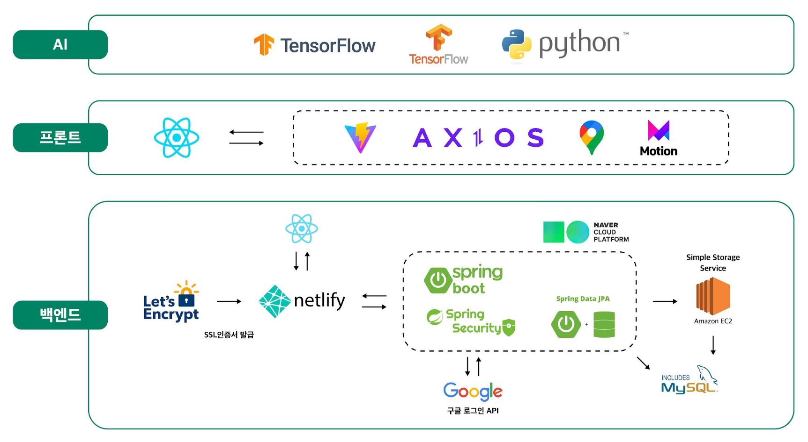

### 환경을 위한 행동, 모두가 참여하는 서비스 (PICKTRE, Pick Trash)


[](https://github.com/PICKTRE/PICKTRE_frontend/blob/main/LICENSE)
[](https://www.codefactor.io/repository/github/picktre/picktre_frontend)

<div align="center">
 
[](https://www.youtube.com/embed/6T34HNa5KHw?autoplay=1)
    
</div>

---

### 개발 배경

현대 사회에서 쓰레기 문제는 점점 심각해지고 있으며, 쓰레기의 적절한 처리는 환경보호와 지속가능한 발전을 위해 중요한 문제로 인식되고 있습니다.

하지만, 여전히 공공장소에서 쓰레기를 적절하게 버리지 않는 경우가 많아 환경오염과 공공장소의 미관을 해치는문제가 발생하고 있습니다.

이러한 배경에서 PICKTRE는 쓰레기를 적절하게 처리하고, 시민들의 쓰레기 버리기 습관을 개선하여 환경보호와 재활용 문화를 확산 시키는데 목적을 두고 있습니다. 또한, 사용자들이 쓰레기를 버릴 때 보상을 제공하여 쓰레기 문제에 대한 인식과 참여 향상을 목표로 합니다.

---

### 웹 서버 아키텍쳐

<div align="center">
  
</div>

---

### 프로젝트 시작 (로컬)

1. 프로젝트를 clone 합니다.

```jsx
git clone https://github.com/PICKTRE/PICKTRE_frontend.git
```

2. clone이 완료되었다면, 다음 명령어로 npm library들을 설치합니다.

```jsx
npm i
```

1. 프로젝트를 실행합니다.

```jsx
npm run dev
```

---

### 프로젝트 시작

1. PICKTRE에 접속합니다.

```
https://picktre.netlify.app
```

---

### 소스 디렉토리

---

## 프로젝트 결과

### 1. 작품 사진

<br>

<p align="center">
  
  
  
  
  
  
  
  
  
  
  
  
  
  
</p>


---

### 라이센스

`PICKTRE/PICKTRE_frontend`

- [MIT License](https://github.com/PICKTRE/PICKTRE_frontend/blob/main/LICENSE)

`facebook/react`

- https://github.com/facebook/react

- [MIT License](https://github.com/facebook/react/blob/main/LICENSE)

`vitejs/vite`

- https://github.com/vitejs/vite

- [MIT License](https://github.com/vitejs/vite/blob/main/LICENSE)

`googlemaps/google-maps-services-js`

- https://github.com/googlemaps/google-maps-services-js

- [Apache License 2.0](https://github.com/googlemaps/google-maps-services-js/blob/master/LICENSE.md)

`tensorflow/tfjs-models`

- https://github.com/tensorflow/tfjs-models

- [Apache License 2.0](https://github.com/tensorflow/tfjs-models/blob/master/LICENSE)

`framer/motion`

- https://github.com/framer/motion

- [MIT License](https://github.com/framer/motion/blob/main/LICENSE.md)
